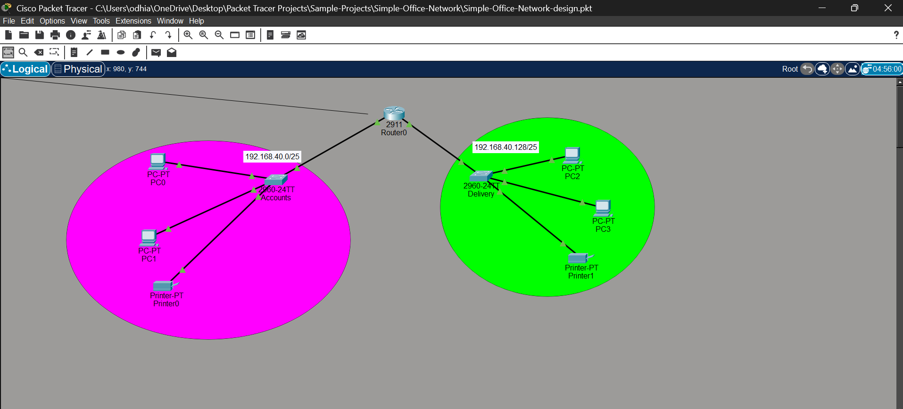

# Simple Office Network - Accounts & Delivery Departments

## 1. Project Overview
This project is a Cisco Packet Tracer network designed to connect two distinct departments (**Accounts** and **Delivery**) through a central router. It implements subnetting to divide a single network address into two separate broadcast domains while allowing inter-departmental communication.

## 2. Project Objectives
* Connect the Accounts and Delivery departments, each containing at least two end devices.
* Utilize appropriate network devices (Router and Switches).
* Subnet the given network address `192.168.40.0` across department interfaces with proper IP addresses, subnet masks, and default gateways.
* Ensure full end-to-end connectivity and ping test success between departments.

## 3. Network Topology

## 4. Network Devices
| Device Name | Device Type | Purpose |
| :--- | :--- | :--- |
| **Router0** | Cisco 2911 Router | Acts as the core gateway routing traffic between the two subnets |
| **Accounts** | Cisco 2960-24TT Switch | Connects devices inside the Accounts department |
| **Delivery** | Cisco 2960-24TT Switch | Connects devices inside the Delivery department |
| **PC0, PC1** | Workstations | End-user computers in the Accounts department |
| **Printer0** | Network Printer | Peripheral device in the Accounts department |
| **PC2, PC3** | Workstations | End-user computers in the Delivery department |
| **Printer1** | Network Printer | Peripheral device in the Delivery department |

## 5. IP Addressing & Subnetting
The network address `192.168.40.0/24` is divided into two `/25` subnets:

* **Accounts Subnet:** `192.168.40.0/25` (Subnet Mask: `255.255.255.128`)
* **Delivery Subnet:** `192.168.40.128/25` (Subnet Mask: `255.255.255.128`)

| Device / Interface | IP Address | Subnet Mask | Default Gateway |
| :--- | :--- | :--- | :--- |
| **Router0 (Subinterface/Port)** | 192.168.40.1 (Accounts)   192.168.40.129 (Delivery) | 255.255.255.128 | — |
| **PC0** | 192.168.40.2 | 255.255.255.128 | 192.168.40.1 |
| **PC1** | 192.168.40.3 | 255.255.255.128 | 192.168.40.1 |
| **Printer0** | 192.168.40.4 | 255.255.255.128 | 192.168.40.1 |
| **PC2** | 192.168.40.130 | 255.255.255.128 | 192.168.40.129 |
| **PC3** | 192.168.40.131 | 255.255.255.128 | 192.168.40.129 |
| **Printer1** | 192.168.40.132 | 255.255.255.128 | 192.168.40.129 |

## 6. Network Configuration
* **Switch-to-End Device Connections:** Copper Straight-Through cables connect PCs and printers to their respective departmental switches.
* **Router-to-Switch Connections:** Copper Straight-Through cables connect the departmental switches to the central Router0 interfaces.
* **Inter-VLAN / Routing:** Configured gateway IPs on the router interfaces so traffic can pass seamlessly between the Accounts and Delivery subnets.

## 7. How the Network Works
The network isolates the Accounts and Delivery departments into separate subnets using a `/25` mask. When a PC in the Delivery department communicates with a PC in the Accounts department, the packet travels through the local switch, hits Router0's gateway interface, and is routed to the destination subnet.

## 8. Testing and Verification
* **Ping Tests:** Verified successfully by running `ping` commands from Delivery department PCs to Accounts department PCs.
* **Simulation Mode:** Inspected ICMP packets traveling across the router to confirm proper encapsulation and gateway forwarding.

## 9. How to Open the Project
1. Download and install [Cisco Packet Tracer](https://www.netacad.com/courses/packet-tracer).
2. Clone or download this repository.
3. Open `Simple-Office-Network-design.pkt` in Cisco Packet Tracer.

## 10. Future Improvements
* Implement VLAN tagging (802.1Q) on a single switch or trunk link.
* Configure DHCP services on the router to dynamically assign IP addresses.
* Add access control lists (ACLs) to restrict inter-department traffic for security.